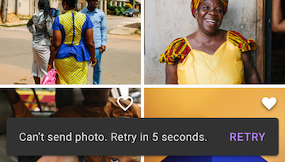
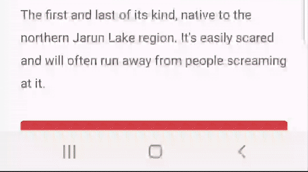

# Snackbars!
### This section will tell you a little bit about Snackbars. We'll show you both the native component and some custom components we've made while working on different projects. We'll also point you what differs custom components from the native one and why making a custom component can be a challenging and time-consuming task.
  
  
  
 
## NATIVE SNACKBAR:
### General info:
* Snackbars provide brief messages about app processes at the bottom of the screen.
* Snackbars contain out of: Text, container and action (optional).
* Snackbar container can be modified (the background color can the changed or a background resource can be set).
* **For additional information, options and customization of the native component, please carefully read these guidelines:** https://material.io/design/components/snackbars.html#

### Samples:
* Native Snackbar with black container and an action: 
   

  
  
  

## CUSTOM SNACKBARS:

## Not an ordinary Snackbar
### General info:
* This particular custom-view was used in Zagreb Be There.

### Native diferences:
* This component is made entirely custom. From layout to animations. This enables the component to be placed anywhere on the screen. Currently, the only animation defined is showing the snackbar transitioning down-to-up and hiding it up-to-down, even though this can very easily be adjusted (for instance showing it up-to-down, of left-to-right) since this is a custom made component. There is also an action button on the right which can be set to perform a specific action.

### Samples:
 

### Customizable properties:
| Name          | Desc          |
| ------------- |:-------------:|
| Background colour      | *(Ivory colour in the preview)*      |
| Text colour      | *(Red(ish) in the preview)*      |
| Text size      | --      |
| Animation duration      | Duration of the down-to-up transition and reverse.      |
| Auto dismiss time     | The time necessary to auto-dismiss snackbar if there is no close button defined.      |
| Button drawable      | Icon of the button.      |

  
  
