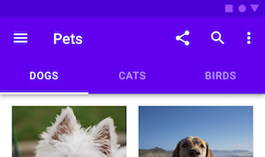
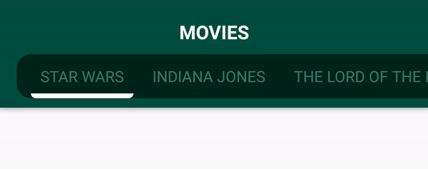
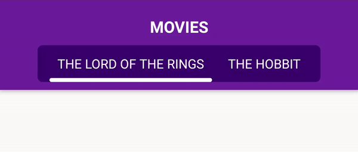
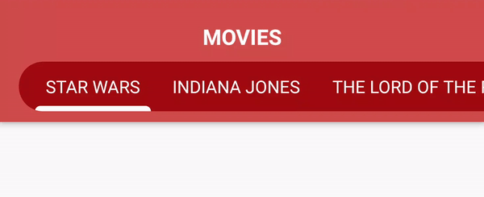

# Tab Bars!
### This section will tell you a little bit about Tabs. We'll show you both the native component and some custom components we've made while working on different projects. We'll also point you what differs custom components from the native one and why making a custom component can be a challenging and time-consuming task.
  
  
  
 
## NATIVE TABS:
### General info:
* Tabs can contain either text or icons (or text-icons combined) to show information.
* The selected tab will always be marked with underline coloured in application accent colour (although the underline color of the tab bar can easily be changed).
* The width of tabs is always proportional to the number of tabs and the tab bar width (see native samples below).
* **For additional information, options and customization of the native component, please carefully read these guidelines:** https://material.io/design/components/tabs.html#

### Samples:
* Native Tabs with text titles only: 
   
* Native Tabs with text-icons combined titles: 
   

  
  
  

## CUSTOM TAB BARS:

## Rounded Tab Bar Layout
### General info:
* This particular custom-view was used in Zagreb Be There.
* It is used for content navigation/categorization.

### Native diferences:
* This tab bar has nothing in common with the native component. It was made completely custom - from layout to animations. Also notice how every item has its own width which is not proportional to the number of categories in the tab bar and the tab bar width. This makes this component suitable to fit any number of categories, since the whole tab bar layout is scrollable. Currently, only text can be added as a category title (no icons).

### Samples:
 
 
 

### Customizable properties:
| Name          | Desc          |
| ------------- |:-------------:|
| Background colour      | *(Dark green in the 1st preview)*      |
| Text colour      | *(Green in the 1st preview)*       |
| Corner radius     | *(Corner radius of the dark green/purple/red category container in the previews)*       |
| Indicator drawable      | *(Notice how indicator corner radius change in the preview)*       |
| Indicator colour      | *(White in all previews)*       |

  
  
