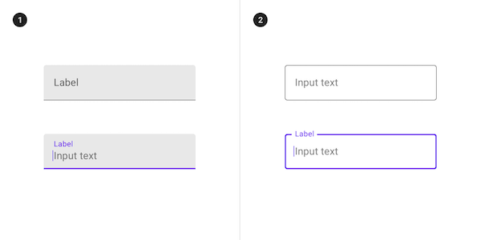
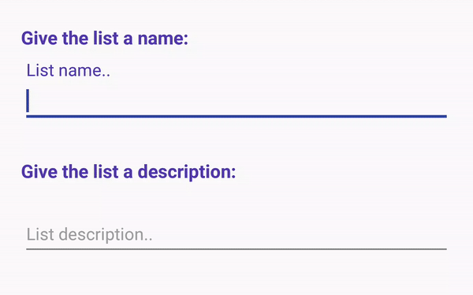
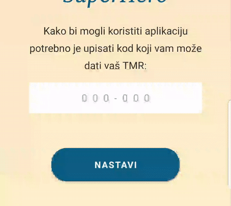
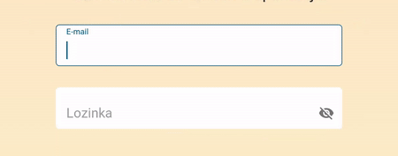
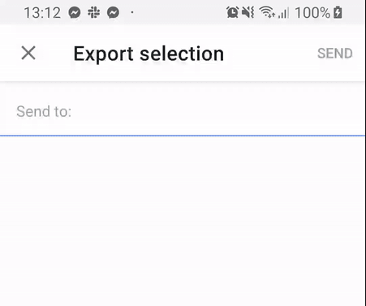

# Text Fields!
### This section will tell you a little bit about text fields. We'll show you both the native component and some custom components we've made while working on different projects. We'll also point you what differs custom components from the native one and why making a custom component can be a challenging and time-consuming task.
  
  
  
 
## NATIVE TEXT INPUT:
### General info:
* There are two types of the native text field: Filled and Outlined.
* Both contain the label which always performs the same animation when text input has started.
* The label is animated from the placeholder state to the hint state in the upper left corner of the field.
* That animation cannot be customizable.
* Also, the colors of the label (hint) and underline/outline will change on the start of text input, accordingly to 3 main application colors defined within the project (colorPrimary, colorPrimaryDark and colorAccent).
* There is a state for displaying erros as well.
* **For additional options and customization of the native component, please carefully read these guidelines:** https://material.io/design/components/text-fields.html#

### Samples:
* Native input types: 
   
* Native input in action: 
   

  
  
  

## CUSTOM TEXT INPUTS:

## Webish-Edit-Text
### General info:
* This particular custom-view was used in BAT SuperHero App.
* It is used for text input.

### Native diferences:
* Since this text field needs to be filled and outlined at the same time and it also requires an error state which differs from the native implementation, the whole label animation part had to be completely removed. The stroke selector (changing outline colors according to active/inactive/error state) was also custom-implemented and the error message had to be created as a separate component inside the view with a custom text watcher. This also means different handling of the component while implementing it from the dev side.

### Samples:
 

### Customizable properties:
| Name          | Desc          |
| ------------- |:-------------:|
| Background colour      | *(White in the preview)*      |
| Field-active stroke colour      | *(Blue in the preview)*       |
| Field-inactive stroke colour      | *(White in the preview)*       |
| Field-error stroke colour      | *(Red in the preview)*       |
| Input type      | Text, number, email, password..     |
| Max length      | Maximum number of characters       |
| Text colour      | --      |
| Font Family      | --      |
| Corner radius     | --      |

  
  

## Webish-Edit-Text *ft.* Material-Hint
### General info:
* This particular custom-view was used in BAT SuperHero TMR App.
* It is used for text input.

### Native diferences:
* Since this text field needs to be filled and outlined at the same time but the label animation and the error state are sticking to native implementation, only the the stroke selector (changing outline colors according to active/inactive state) was custom-implemented. Thus, the outline is not colored red when error occurs since that would require a custom text watcher implementation. Instead, the error text is colored red.

### Samples:
 

### Customizable properties:
| Name          | Desc          |
| ------------- |:-------------:|
| Background colour      | *(White in the preview)*      |
| Field-active stroke colour      | *(Blue in the preview)*       |
| Field-inactive stroke colour      | *(White in the preview)*       |
| Error text colour      | *(Red in the preview)*       |
| Input type      | Text, number, email, password..     |
| Max length      | Maximum number of characters       |
| Text colour      | --      |
| Font Family      | --      |
| Corner radius     | --      |

  
  

## Gmail-like autocomplete input
### General info:
* This particular custom-view was used in Mediatoolkit app.
* It is used for generating tokens which contain information for selected contacts inside the text field. It imitates the Gmail contact input behavior.

### Native diferences:
* Even though this behavior can be seen in many native Android applications (like Gmail) this actually isn't a native component. To accomplish this, we used a foreign library and still had to make quite a customization of our own. It was not an easy challenge to make this working, but here it is. As you can see here, there is no image shown for the contacts without the image in the phonebook and we made the support for manual contact enter as well. Therefore, the tokens which represent contacts are highly customizable (talking both about behavior and design).

### Samples:
 

### Customizable properties:
| Name          | Desc          |
| ------------- |:-------------:|
| Token graphic      | Pretty much any design since it is a custom made component as well.      |
| Placeholder/hint text      | With or without it.      |

  
  
